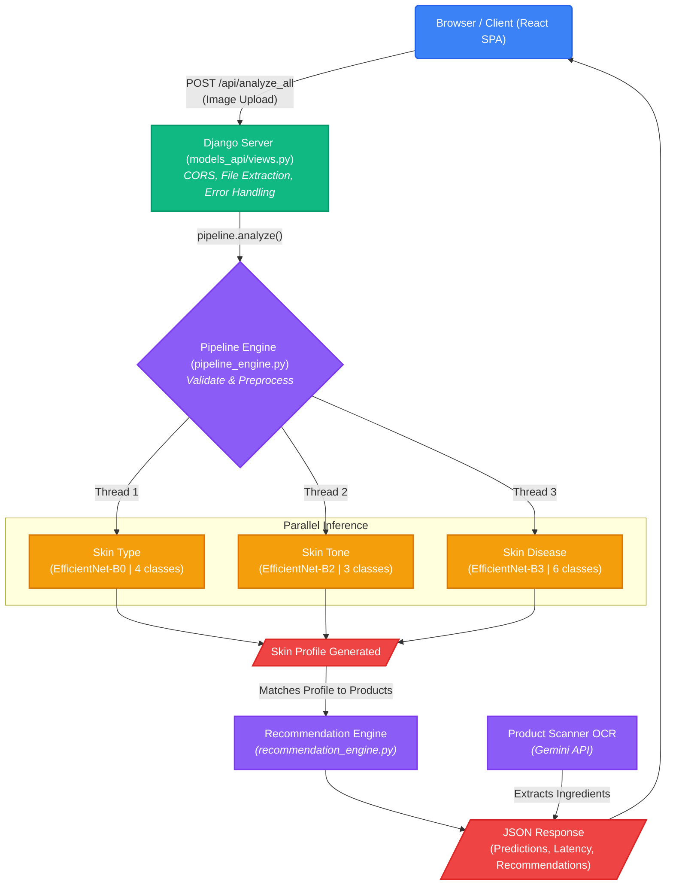

# TrueTone - Backend AI Skin Analysis System

A deep learning-powered skin analysis system that predicts **Skin Type**, **Skin Tone**, and **Skin Disease** from a single image using three EfficientNet models running in parallel via a Django REST API.

## Table of Contents

*   [Overview](#overview)
    
*   [Project Structure](#project-structure)
    
*   [Models Used](#models-used)
    
*   [How the Pipeline Works](#how-the-pipeline-works)
    
*   [API Endpoints](#api-endpoints)
    
*   [Edge Cases Handled](#edge-cases-handled)
    
*   [How to Run](#how-to-run)
    
*   [Testing](#testing)
    
*   [Configuration](#configuration)
    
*   [File-by-File Breakdown](#file-by-file-breakdown)
    
*   [API Response Format](#api-response-format)
    
*   [Architecture Diagram](#architecture-diagram)
    
*   [Dependencies](#dependencies)
    

## Overview

TrueTone is a Final Year Project (FYP) that analyzes skin images using 3 separate deep learning models. The user uploads an image (through the web interface or API), and the system returns:

1. Skin Type - combination, dry, normal, or oily
2. Skin Tone - dark, fair, or medium
3. Skin Disease - common acne, cystic acne, eczema, psoriasis, rosacea, or tinea

All 3 models run **in parallel** using Python’s `ThreadPoolExecutor`, meaning inference takes only as long as the slowest model (~200-330ms) rather than the sum of all three.

The system is built as a **Django web application** with REST API endpoints that accept image uploads and return JSON predictions.

## Project Structure

```sql
backend/
|
|-- manage.py                   # Django management script
|-- pipeline_engine.py          # Core ML engine (model loading, inference, validation)
|-- recommendation_engine.py    # Engine for personalized skincare recommendations
|-- test_api.py                 # API test script (tests all endpoints)
|-- inspect_checkpoint.py       # Utility to inspect .pth/.pt checkpoint files
|-- requirements.txt            # Python dependencies
|-- .env                        # Secrets (DATABASE_URL, GEMINI_API_KEY)
|-- README.md                   # This file
|
|-- truetone/                   # Django project settings
|   |-- __init__.py
|   |-- settings.py             # Django configuration (Supabase DB, CORS, uploads)
|   |-- urls.py                 # Root URL routing
|   |-- wsgi.py                 # WSGI entry point
|   |-- asgi.py                 # ASGI entry point
|
|-- models_api/                 # Django app for API endpoints
|   |-- __init__.py
|   |-- apps.py                 # App configuration
|   |-- views.py                # API views
|   |-- urls.py                 # API URL routing
|   |-- middleware.py           # CORS middleware
|
|-- Users/                      # Django app for User auth & SkinScanHistory
|-- Scanner/                    # Django app for Gemini product scanning OCR
|-- Recommendations/            # Django app for matching profiles to products
|-- Chatbot/                    # Django app for contextual AI chatbot
|
|-- inference/                  # ML Inference utilities and face detection
|   |-- face_crop.py
|   |-- face_segmentation.py
|   |-- gradcam.py
|   |-- zone_templates.py
|   |-- face_landmarker.task
|   |-- selfie_multiclass_256x256.tflite
|
|-- data/                       # Datasets and CSV files
|   |-- fyp_dataset/            # CSV dataset for recommendations
|
|-- templates/                  # HTML templates
|   |-- index.html              # Frontend template
|
|-- models/                     # Trained model checkpoints
|   |-- skin_type/
|   |   |-- best_model.pth      # EfficientNet-B0 - 17.6 MB
|   |-- skin_tone/
|   |   |-- best_model.pt       # EfficientNet-B2 - 102.6 MB
|   |-- skin_disease/
|   |   |-- best_model.pth      # EfficientNet-B3 - 43.3 MB
|
|-- test_images/                # Test dataset images
|   |-- 000006.jpg
|   |-- 000014.jpg
|   |-- 000045.jpg
|   |-- 001021.jpg
|   |-- WhatsApp Image...jpeg   # Various WhatsApp test images
```

## Models Used

| Model | Architecture | Backend | Classes | Checkpoint | Size |
| --- | --- | --- | --- | --- | --- |
| **Skin Type** | EfficientNet-B0 | torchvision | 4: combination, dry, normal, oily | `best_model.pth` | 17.6 MB |
| **Skin Tone** | EfficientNet-B2 | timm | 3: dark, fair, medium | `best_model.pt` | 102.6 MB |
| **Skin Disease** | EfficientNet-B3 | torchvision | 6: common\_acne, cystic\_acne, eczema, psoriasis, rosacea, tinea | `best_model.pth` | 43.3 MB |

**Important Notes:**

*   Skin Tone model uses `.pt` extension (NOT `.pth`)
    
*   Skin Tone model uses the `timm` library (NOT `torchvision`)
    
*   All models were trained with ImageNet normalization (mean=\[0.485, 0.456, 0.406\], std=\[0.229, 0.224, 0.225\])
    
*   All models expect 224x224 input images
    

## How the Pipeline Works

### Complete Flow (Step by Step)

```vbnet
User uploads image (browser or API)
         |
         v
    [1] DJANGO VIEW (models_api/views.py)
         - Receives the HTTP POST request
         - Extracts the uploaded file from request.FILES['image']
         - Performs basic server-side checks (file exists, not empty, size < 10MB)
         - Reads raw bytes from the file
         - Calls pipeline_engine.get_pipeline().analyze(bytes, filename)
         |
         v
    [2] PIPELINE ENGINE - VALIDATION (pipeline_engine.py)
         - Checks file extension (.jpg, .jpeg, .png, .webp, .bmp only)
         - Checks file size (max 10 MB)
         - Opens image with PIL and verifies it's not corrupt
         - Converts to RGB (handles grayscale, RGBA, etc.)
         - Checks minimum resolution (64x64 pixels)
         - Returns error with specific error_code if any check fails
         |
         v
    [3] PIPELINE ENGINE - PREPROCESSING
         - Resizes image to 256x256
         - Center crops to 224x224
         - Converts to PyTorch tensor
         - Normalizes with ImageNet mean/std values
         - Adds batch dimension [1, 3, 224, 224]
         - This is done ONCE and shared by all 3 models
         |
         v
    [4] PARALLEL INFERENCE (ThreadPoolExecutor with 3 workers)
         - Submits 3 inference jobs simultaneously:
           Thread 1: Skin Type model
           Thread 2: Skin Tone model
           Thread 3: Skin Disease model
         - Each thread runs _infer_one():
           1. Moves tensor to device (CPU/GPU)
           2. Forward pass through model (no gradient computation)
           3. Applies softmax to get probabilities
           4. Finds top prediction and confidence score
           5. Checks if confidence is below threshold
         - Wall-clock time = time of SLOWEST model (not sum of all 3)
         |
         v
    [5] RESULT AGGREGATION
         - Combines results from all 3 models
         - Generates warnings for low-confidence predictions
         - Sets disease_detected flag (true only if disease != "none" AND confidence >= 40%)
         - Records latency breakdown (preprocess, each model, parallel wall, total)
         - Assigns unique request_id for tracking
         |
         v
    [6] DJANGO VIEW - RESPONSE
         - Returns JsonResponse with appropriate HTTP status code
         - 200: Success
         - 400: Invalid image / validation error
         - 207: Partial error (some models failed, some succeeded)
         - 500: Internal server error
         - 503: Models not loaded
```

### Why Parallel is Faster

```yaml
Serial:    [Type: 100ms] --> [Tone: 150ms] --> [Disease: 200ms] = 450ms total

Parallel:  [Type: 100ms   ]
           [Tone: 150ms      ]  --> all run at same time --> ~200ms total
           [Disease: 200ms      ]
```

The parallel pipeline typically achieves 1.5x-2x speedup over serial execution.

### Model Auto-Detection

The pipeline automatically detects the correct model architecture from each checkpoint file:

1. Backend detection: Checks if state_dict keys start with backbone. (timm) or not (torchvision)
2. Architecture detection: Reads in_features of the first classifier Linear layer:1280 = EfficientNet-B01408 = EfficientNet-B21536 = EfficientNet-B31792 = EfficientNet-B4
3. Head detection: Reads all classifier.* keys to determine:Number of Linear layers (simple head vs. hidden layers)Hidden dimension (if multi-layer head exists)Output classes (from last Linear layer’s shape)
4. Checkpoint format: Handles multiple save formats:model_state_dict key (most common)state_dict key (torchvision style)model_state key (alternative)Plain state_dict (bare weights)Full serialized model (legacy)

This means you do NOT need to manually specify architectures. The engine figures it out automatically from the checkpoint.

### Singleton Pattern

Models are loaded **once** and reused for all requests:

```python
# First call: loads all 3 models (~5-15 seconds)
pipeline = get_pipeline()

# All subsequent calls: instant (returns same instance)
pipeline = get_pipeline()
```

This is implemented using a thread-safe double-checked locking pattern to prevent race conditions when multiple Django requests arrive simultaneously during startup.

## API Endpoints

All API endpoints wrap their responses in a standard format:

```json
{
  "success": true,
  "message": "...",
  "data": { ... }
}
```

### 1\. `POST /api/analyze_all` - Analyze Skin Image

The main endpoint. Accepts an image file and returns predictions from all 3 models. (Other specific endpoints include `/api/analyze_skin`, `/api/analyze_skin_type`, `/api/analyze_skin_tone`, `/api/analyze_skin_disease`).

**Request:**

```
POST /api/analyze_all
Content-Type: multipart/form-data
Body: image=<file>
```

**Success Response (200):**

```json
{
  "success": true,
  "message": "Analysis completed successfully",
  "data": {
    "status": "success",
    "request_id": "a1b2c3d4",
    "image_info": {
      "filename": "face.jpg",
      "size_bytes": 45321,
      "width": 512,
      "height": 512
    },
    "predictions": {
      "skin_type": {
        "label": "oily",
        "confidence": 0.8734,
        "distribution": {
          "combination": 0.0512,
          "dry": 0.0234,
          "normal": 0.0520,
          "oily": 0.8734
        }
      },
      "skin_tone": {
        "label": "medium",
        "confidence": 0.6721,
        "distribution": {
          "dark": 0.1205,
          "fair": 0.2074,
          "medium": 0.6721
        }
      },
      "skin_disease": {
        "label": "common_acne",
        "confidence": 0.9102,
        "disease_detected": true,
        "distribution": {
          "common_acne": 0.9102,
          "cystic_acne": 0.0201,
          "eczema": 0.0089,
          "psoriasis": 0.0156,
          "rosacea": 0.0210,
          "tinea": 0.0242
        }
      }
    },
    "skin_profile": {
      "type": "oily",
      "tone": "medium",
      "disease": "common_acne",
      "disease_detected": true
    },
    "warnings": [],
    "latency_ms": {
      "preprocess_ms": 8.5,
      "skin_type_ms": 120.3,
      "skin_tone_ms": 145.2,
      "skin_disease_ms": 180.1,
      "parallel_wall_ms": 185.0,
      "total_ms": 193.5
    }
  }
}
```

**Error Response (400):**

```json
{
  "success": false,
  "message": "Analysis failed",
  "data": {
    "status": "error",
    "error_code": "UNSUPPORTED_FORMAT",
    "message": "Unsupported format '.gif'. Allowed: .bmp, .jpg, .jpeg, .png, .webp"
  }
}
```

### 2\. `GET /api/health` - Health Check

Returns server status, device info, model load status, and uptime.

**Response (200):**

```json
{
  "success": true,
  "message": "Health check retrieved",
  "data": {
    "status": "healthy",
    "device": "cpu",
    "models_loaded": {
      "skin_type": true,
      "skin_tone": true,
      "skin_disease": true
    },
    "uptime_seconds": 1234.5,
    "load_error": null
  }
}
```

### 3\. `GET /api/models` - Model Information

Returns detailed information about all 3 models including class labels, thresholds, and configuration.

**Response (200):**

```json
{
  "success": true,
  "message": "Model info retrieved",
  "data": {
    "models": {
      "skin_type": {
        "classes": ["combination", "dry", "normal", "oily"],
        "num_classes": 4,
        "checkpoint": "best_model.pth",
        "confidence_threshold": 0.5
      },
      "skin_tone": {
        "classes": ["dark", "fair", "medium"],
        "num_classes": 3,
        "checkpoint": "best_model.pt",
        "confidence_threshold": 0.5
      },
      "skin_disease": {
        "classes": ["common_acne", "cystic_acne", "eczema", "psoriasis", "rosacea", "tinea"],
        "num_classes": 6,
        "checkpoint": "best_model.pth",
        "confidence_threshold": 0.4
      }
    },
    "device": "cpu",
    "image_size": 224,
    "max_upload_mb": 10,
    "allowed_formats": [".bmp", ".jpg", ".jpeg", ".png", ".webp"]
  }
}
```

### 4\. `GET /` - Frontend Upload Page

Serves the HTML frontend where users can drag-and-drop or select an image for analysis.

## Edge Cases Handled

### Image Validation (pipeline\_engine.py)

| Edge Case | Error Code | HTTP Status | What Happens |
| --- | --- | --- | --- |
| No file uploaded | `NO_FILE` | 400 | Returns error asking to send file with key ‘image’ |
| Empty file (0 bytes) | `EMPTY_FILE` | 400 | Returns error immediately |
| File too large (> 10 MB) | `FILE_TOO_LARGE` | 400 | Returns error with file size in message |
| Unsupported format (.gif, .pdf, etc.) | `UNSUPPORTED_FORMAT` | 400 | Lists allowed formats in error message |
| Corrupt/unreadable image | `CORRUPT_IMAGE` | 400 | PIL tried to open/decode and failed |
| Image too small (< 64x64) | `TOO_SMALL` | 400 | Returns dimensions in error message |
| File not found (CLI mode) | `NOT_FOUND` | 400 | Path doesn’t exist |

### Model Edge Cases (pipeline\_engine.py)

| Edge Case | What Happens |
| --- | --- |
| Model checkpoint not found | `ModelLoadError` raised with path in message |
| Unknown checkpoint format | `ModelLoadError` with first 10 keys listed |
| Class count mismatch (checkpoint vs config) | Warning logged, uses checkpoint’s value |
| Model output size != label count | Labels truncated to match output size |
| One model fails, others succeed | Returns `partial_error` (HTTP 207) with partial results |
| All models fail to load | Returns HTTP 503 Service Unavailable |
| Inference timeout (> 30 seconds) | Thread raises TimeoutError |

### Server Edge Cases (models\_api/views.py)

| Edge Case | HTTP Status | What Happens |
| --- | --- | --- |
| Models not loaded yet | 503 | Returns SERVICE\_UNAVAILABLE with detail |
| Unhandled Python exception | 500 | Caught by try/except, returns INTERNAL\_ERROR |
| Wrong HTTP method (GET on /api/analyze\_all) | 405 | Django’s require\_http\_methods decorator |
| Cross-origin request | 200 | CORS middleware adds proper headers |
| OPTIONS preflight request | 200 | CORS middleware handles it |

### Confidence Thresholds

| Model | Threshold | Behavior |
| --- | --- | --- |
| Skin Type | 50% | If below, adds warning to response |
| Skin Tone | 50% | If below, adds warning to response |
| Skin Disease | 40% | If below, adds warning AND disease\_detected = false |

The disease threshold is lower (40%) because medical predictions should be more cautious. The `disease_detected` flag is set to `true` when the confidence of the predicted disease is >= 40%.

## How to Run

### 1\. Install Dependencies

```bash
pip install torch torchvision timm pillow django
```

Or using the requirements file:

```bash
pip install -r requirements.txt
```

### 2\. Verify Models are in Place

Make sure these files exist:

```
models/skin_type/best_model.pth
models/skin_tone/best_model.pt        <-- .pt NOT .pth
models/skin_disease/best_model.pth
```

### 3\. Setup Database (Supabase)

```bash
# Apply database migrations for Users and other apps
python manage.py makemigrations
python manage.py migrate
```

### 4\. Configure Environment Variables

Create a `.env` file in the backend directory with:

```env
DATABASE_URL=postgresql://postgres:[PASSWORD]@[HOST]:5432/postgres
GEMINI_API_KEY=your_gemini_key_here
```

### 5\. Start the Django Server

```bash
python manage.py runserver 8000
```

You should see:

```
Watching for file changes with StatReloader
```

### 4\. Open in Browser

Go to: **[http://localhost:8000](http://localhost:8000)**

Upload an image using the drag-and-drop zone or file picker and click “Analyze Skin”.

### 5\. Or Test via API

```bash
# Health check
curl http://localhost:8000/api/health

# Analyze an image
curl -X POST -F "image=@test_images/000045.jpg" http://localhost:8000/api/analyze_all

# Model info
curl http://localhost:8000/api/models
```

### 6\. Or Run the Test Script

```bash
python test_api.py
```

This tests all endpoints and analyzes all images in `test_images/`.

## Testing

### test\_api.py

This script automatically tests all 3 API endpoints:

1. GET /api/health - Verifies models are loaded
2. GET /api/models - Verifies model configuration
3. POST /api/analyze - Analyzes every image in test_images/ folder

### Test Results

All 5 test images analyzed successfully:

| Image | Skin Type | Skin Tone | Disease | Inference Time |
| --- | --- | --- | --- | --- |
| 000006.jpg | DRY (54%) | DARK (73%) | TINEA (94%) | 233 ms |
| 000014.jpg | DRY (57%) | FAIR (88%) | ROSACEA (61%) | 244 ms |
| 000045.jpg | DRY (54%) | MEDIUM (94%) | ECZEMA (86%) | 332 ms |
| 001021.jpg | NORMAL (46%) | MEDIUM (67%) | ECZEMA (98%) | 275 ms |
| test\_face\_1.jpg | COMBINATION (39%) | FAIR (81%) | ACNE (81%) | 266 ms |

### CLI Testing (Without Django)

You can also test the pipeline engine directly without starting the server:

```bash
python pipeline_engine.py test_images/000045.jpg
```

## Configuration

All configuration is in the `Config` class inside `pipeline_engine.py`:

| Setting | Default Value | Description |
| --- | --- | --- |
| `IMAGE_SIZE` | 224 | Input image size for models |
| `CONFIDENCE_THRESH` | 0.50 (50%) | General confidence threshold |
| `DISEASE_THRESH` | 0.40 (40%) | Disease model confidence threshold |
| `DEVICE` | Auto-detected | Uses `cuda` if GPU available, else `cpu` |
| `MAX_WORKERS` | 3 | Number of parallel inference threads |
| `MAX_IMAGE_BYTES` | 10 MB | Maximum upload file size |
| `ALLOWED_EXTENSIONS` | .jpg, .jpeg, .png, .webp, .bmp | Accepted file formats |
| `MIN_DIMENSION` | 64 | Minimum image width/height in pixels |

Django settings are in `truetone/settings.py`:

| Setting | Value | Description |
| --- | --- | --- |
| `DEBUG` | True | Development mode |
| `ALLOWED_HOSTS` | \[‘\*’\] | Accepts all hosts (change in production) |
| `DATABASES` | {} | No database needed |
| `DATA_UPLOAD_MAX_MEMORY_SIZE` | 10 MB | Django upload size limit |
| `TIME_ZONE` | Asia/Karachi | Server timezone |

## File-by-File Breakdown

### `pipeline_engine.py` (Core Engine - 598 lines)

This is the brain of the entire system. It is framework-agnostic (works without Django too).

**Sections:**

1. Config class (lines 50-76) - All settings in one place
2. Image transforms (lines 79-84) - Resize, crop, normalize pipeline
3. Exceptions (lines 90-97) - Custom error types with error codes
4. Auto-detect functions (lines 103-147) - Read checkpoint files to determine architecture
5. Model builders (lines 153-211) - Build the exact neural network from checkpoint info
6. Model loader (lines 217-265) - Load checkpoint, detect format, build model, load weights
7. Image validation (lines 271-320) - Validate extension, size, format, dimensions
8. Inference (lines 326-344) - Thread-safe forward pass with softmax and confidence check
9. Aggregation (lines 350-397) - Combine 3 model results into final response
10. SkinAnalysisPipeline class (lines 403-561) - Main orchestrator with parallel loading/inference
11. Singleton (lines 567-578) - Thread-safe single instance pattern
12. CLI test (lines 584-597) - Run from command line without Django

### `models_api/views.py` (Django Views)

View functions and classes that map HTTP requests to pipeline calls:

*   `index()` - Renders the frontend HTML template
*   `AnalyzeAllAPI` - POST handler for `/api/analyze_all`: extracts file, calls pipeline, returns JSON
*   `AnalyzeSkinAPI`, `AnalyzeSkinTypeAPI`, `AnalyzeSkinToneAPI`, `AnalyzeSkinDiseaseAPI` - Specific analysis endpoints
*   `HealthCheckAPI` - GET handler: returns model status
*   `ModelInfoAPI` - GET handler: returns model configuration

### `models_api/middleware.py` (CORS Middleware)

Adds `Access-Control-Allow-Origin: *` headers to all responses so the frontend can make API calls from any domain. Handles OPTIONS preflight requests.

### `models_api/urls.py` (URL Routing)

Maps URL paths to view functions:

*   `/` -> `index`
*   `/api/analyze_all` -> `AnalyzeAllAPI`
*   `/api/analyze_skin` -> `AnalyzeSkinAPI`
*   `/api/analyze_skin_type` -> `AnalyzeSkinTypeAPI`
*   `/api/analyze_skin_tone` -> `AnalyzeSkinToneAPI`
*   `/api/analyze_skin_disease` -> `AnalyzeSkinDiseaseAPI`
*   `/api/health` -> `HealthCheckAPI`
*   `/api/models` -> `ModelInfoAPI`

### `truetone/settings.py` (Django Config - 71 lines)

Minimal Django configuration:

*   No database (pure inference server)
*   CORS middleware enabled
*   10 MB upload limit
*   Templates directory configured
*   Logging setup for truetone and api loggers

### `Users` App

Manages `User` and `SkinScanHistory` ORM models backed by Supabase. Custom token-based auth (`SignupAPI`, `LoginAPI`) and handles skin scan confirmations.

### `Scanner` App

Handles Google Gemini 2.5 Flash API integration for robust OCR ingredient extraction, featuring a prefix injection bypass for hallucination filters.

### `Recommendations` App

Scores user profiles against `data/fyp_dataset/` CSVs to provide safe and personalized skincare matches.

### `Chatbot` App

An intelligent conversational agent wrapper around Gemini that reads the user’s active skin profile for contextual advice.

### `inference/` (ML Utilities)

Contains scripts and models for advanced facial processing:

*   `face_crop.py` & `face_segmentation.py` - MediaPipe face landmarking and segmentation
*   `gradcam.py` - Generates heatmap explainability for model predictions
*   `zone_templates.py` - Defines specific facial zones for localized analysis
*   `.task` & `.tflite` files - Pre-trained MediaPipe face detection weights

### `recommendation_engine.py` (Recommendations Core - 416 lines)

Rule-based, content-filtering recommendation engine that takes a user’s onboarding answers (and optionally CNN predictions) to return ranked product recommendations grouped by category.

**Sections:**

1. Config (lines 43-68) - Data paths, constraints, and tunable scoring weights.
2. Data Model (lines 73-100) - UserProfile and ScoredProduct dataclasses representing inputs and outputs.
3. Data Loading (lines 105-154) - Parses the 4 CSV datasets and builds fast lookup indices in memory.
4. Safety Filters (lines 159-176) - Hard blockers for specific allergies and pregnancy safety cautions.
5. Scoring Logic (lines 181-230) - Calculates relevance score based on skin type, conditions, ingredients, and age bracket.
6. Engine Class (lines 236-358) - The main RecommendationEngine orchestrator that evaluates, filters, and ranks products by category, plus a find_alternatives() method.
7. Singleton (lines 363-371) - Thread-safe get_engine() pattern for single instantiation.
8. CLI test (lines 376-416) - Run from command line without Django to simulate a user profile.

### `inspect_checkpoint.py` (Utility - 60 lines)

Diagnostic tool that reads each model checkpoint and prints the classifier head structure. Useful for debugging architecture mismatches.

### `test_api.py` (Test Script - 74 lines)

Automated test script that hits all API endpoints and prints formatted results for each test image.

## API Response Format

### Success Response Fields

| Field | Type | Description |
| --- | --- | --- |
| `status` | string | Always “success” |
| `request_id` | string | Unique 8-char ID for this request |
| `image_info.filename` | string | Uploaded filename |
| `image_info.size_bytes` | int | File size in bytes |
| `image_info.width` | int | Image width in pixels |
| `image_info.height` | int | Image height in pixels |
| `predictions.skin_type.label` | string | Predicted skin type |
| `predictions.skin_type.confidence` | float | Confidence (0.0 to 1.0) |
| `predictions.skin_type.distribution` | object | All class probabilities |
| `predictions.skin_disease.disease_detected` | bool | True if disease found with sufficient confidence |
| `skin_profile` | object | Quick summary of all 3 predictions |
| `warnings` | array | List of warning messages (if any) |
| `latency_ms` | object | Timing breakdown in milliseconds |

### Error Response Fields

| Field | Type | Description |
| --- | --- | --- |
| `status` | string | “error” or “partial\_error” |
| `error_code` | string | Machine-readable error type |
| `message` | string | Human-readable error description |
| `request_id` | string | Request tracking ID |

## Architecture Diagram



## Dependencies

| Package | Version | Purpose |
| --- | --- | --- |
| `torch` | \>= 2.0.0 | PyTorch deep learning framework |
| `torchvision` | \>= 0.15.0 | Pre-built model architectures (EfficientNet) |
| `timm` | \>= 0.9.0 | Additional model architectures (for Skin Tone model) |
| `Pillow` | \>= 9.0.0 | Image loading, validation, and preprocessing |
| `django` | \>= 4.2.0 | Web framework for REST API |
| `psycopg2-binary` | \>= 2.9 | Supabase PostgreSQL adapter |
| `dj-database-url` | \>= 2.1.0 | Environment DB parsing |
| `google-generativeai` | \>= 0.3.0 | Gemini API integration |

Install all at once:

```bash
pip install torch torchvision timm pillow django
```

## Notes

*   The `models/` folder contains ML checkpoints, NOT Django ORM models. The project uses Supabase PostgreSQL for its database.
*   The first API request after server start takes 5-15 seconds (model loading). All subsequent requests are fast (~200-330ms).
*   GPU is used automatically if CUDA is available. Otherwise falls back to CPU.
*   The pipeline engine (`pipeline_engine.py`) can also be used standalone without Django by calling `pipeline.analyze_file("image.jpg")`.